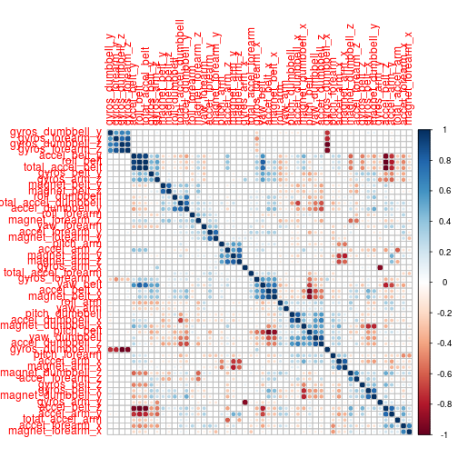
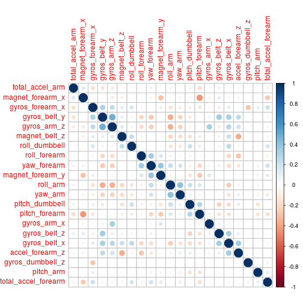

PRACTICAL MACHINE LEARNING: PROJECT
========================================================

### Executive Summary

Using devices such as Jawbone Up, Nike FuelBand, and Fitbit it is now possible to collect a large amount of data about personal activity relatively inexpensively. These type of devices are part of the quantified self movement – a group of enthusiasts who take measurements about themselves regularly to improve their health, to find patterns in their behavior, or because they are tech geeks. One thing that people regularly do is quantify how much of a particular activity they do, but they rarely quantify how well they do it. In this project, the goal will be to use data from accelerometers on the belt, forearm, arm, and dumbell of 6 participants and predict whether they do the activities right or wrong. 
They were asked to perform barbell lifts correctly and incorrectly in 5 different ways. More information is available from the website here: http://groupware.les.inf.puc-rio.br/har (see the section on the Weight Lifting Exercise Dataset). 

### Exploratory Data Analysis
Loading the data and presenting a summary

Loading files

```r
if (!file.exists("pml-training.csv")){
  download.file("https://d396qusza40orc.cloudfront.net/predmachlearn/pml-training.csv")
}

set.seed(23)
## Loading data
data= read.csv("pml-training.csv", sep=",",na.strings = c("NA", ""))
```

Check the number of variables to reduce to non NAs columns.

```r
dim(data)
```

```
## [1] 19622   160
```

## Remove variables with all NA

```r
variables = sapply(data, function(x){sum(is.na(x))})
data = data[,which(variables == 0)]
```

Only 60 out of 160 variables are considered. The rest columns have all NA's Values.

```r
dim(data)
```

```
## [1] 19622    60
```
Reamaining variables
str(data)

## Create training and test partitions

Two partitions are created, training and test, with the 75% of values for training

```r
inTrain = createDataPartition(y=data$classe, p=0.75, list=FALSE)
training = data[inTrain,]
testing = data[-inTrain,]
```

First seven features are removed as well, as they are not related with the final outcome

```r
training = training[,8:60]
training$classe <-as.factor(training$classe)
testing = testing[,8:60]
testing$classe <-as.factor(testing$classe)
```


### Feature selection

However, 53 variables remain a high number of variables, requiring a extensive computer use and computer time. Since many of the variables are correlated, as we see later, it doesn't make sense to include all of them in the model. It would only increase the use of CPU and memory. 

Although many methods of feature reduction are available (combination of features included), in the sake of simplicity, I decided to run a simple covariance analysis. 

First, I scale the variables. The same procedure applies to the testing set.

```r
training.scale<- scale(training[,-53],center=TRUE,scale=TRUE);
testing.scale<- scale(testing[,-53],center=TRUE,scale=TRUE);
```

The next figure presents the correlation values of all the 53 variables. As it could be seen, many of the them are correlated. To avoid using unnecessary variables, I filter the variables using a correlation value of 0.5

```r
corMat <- cor(training.scale)
corrplot(corMat, order = "hclust")
```

 

```r
highlyCor <- findCorrelation(corMat, 0.5)
#Apply correlation filter at 0.70,
#then we remove all the variable correlated with more 0.7.
datMyFiltered.scale <- training.scale[,-highlyCor]
datTestingMyFiltered.scale <- testing.scale[,-highlyCor]
```

The effect of filtering can be seen in the following figure. None of the variables remaining have a higher correlation of 0.5 with any other. And I have reduced from 53 variables to 22 variables, reducind, as a consequence, the computing time.

```r
corMatFiltered <- cor(datMyFiltered.scale)
corrplot(corMatFiltered, order = "hclust")
```

 

Basic data transformation is requiered to include the classe variable.

```r
training = data.frame(datMyFiltered.scale, training[,53])
testing = data.frame(datTestingMyFiltered.scale, testing[,53])
colnames(training)[22] = "classe"
colnames(testing)[22] = "classe"
```

### Feature selection

Once the feature selection done, I build a RandomForest model, without further preprocessing. I use some packages (registerDoParallel and foreach) to speed up the process.


```r
registerDoParallel()
model <- foreach(ntree=rep(150, 6), .combine=randomForest::combine, .packages='randomForest') %dopar% {
  randomForest(x=training[,-22], y=training$classe, ntree=ntree)
}
```


Predicting the training values and getting the confusion matrix.

```r
pred = predict(model,training)
confusionMatrix(pred,training$classe)
```

```
## Confusion Matrix and Statistics
## 
##           Reference
## Prediction    A    B    C    D    E
##          A 4185    0    0    0    0
##          B    0 2848    0    0    0
##          C    0    0 2567    0    0
##          D    0    0    0 2412    0
##          E    0    0    0    0 2706
## 
## Overall Statistics
##                                      
##                Accuracy : 1          
##                  95% CI : (0.9997, 1)
##     No Information Rate : 0.2843     
##     P-Value [Acc > NIR] : < 2.2e-16  
##                                      
##                   Kappa : 1          
##  Mcnemar's Test P-Value : NA         
## 
## Statistics by Class:
## 
##                      Class: A Class: B Class: C Class: D Class: E
## Sensitivity            1.0000   1.0000   1.0000   1.0000   1.0000
## Specificity            1.0000   1.0000   1.0000   1.0000   1.0000
## Pos Pred Value         1.0000   1.0000   1.0000   1.0000   1.0000
## Neg Pred Value         1.0000   1.0000   1.0000   1.0000   1.0000
## Prevalence             0.2843   0.1935   0.1744   0.1639   0.1839
## Detection Rate         0.2843   0.1935   0.1744   0.1639   0.1839
## Detection Prevalence   0.2843   0.1935   0.1744   0.1639   0.1839
## Balanced Accuracy      1.0000   1.0000   1.0000   1.0000   1.0000
```

Finally, I use the test set to get the characteristics of the model.

```r
predictedValues = predict(model, testing)
confusionMatrix(predictedValues, testing$classe)
```

```
## Confusion Matrix and Statistics
## 
##           Reference
## Prediction    A    B    C    D    E
##          A 1389   21    0    1    0
##          B    4  920   18    1    1
##          C    1    5  825   34    0
##          D    0    1   10  763    1
##          E    1    2    2    5  899
## 
## Overall Statistics
##                                           
##                Accuracy : 0.978           
##                  95% CI : (0.9735, 0.9819)
##     No Information Rate : 0.2845          
##     P-Value [Acc > NIR] : < 2.2e-16       
##                                           
##                   Kappa : 0.9721          
##  Mcnemar's Test P-Value : 1.695e-05       
## 
## Statistics by Class:
## 
##                      Class: A Class: B Class: C Class: D Class: E
## Sensitivity            0.9957   0.9694   0.9649   0.9490   0.9978
## Specificity            0.9937   0.9939   0.9901   0.9971   0.9975
## Pos Pred Value         0.9844   0.9746   0.9538   0.9845   0.9890
## Neg Pred Value         0.9983   0.9927   0.9926   0.9901   0.9995
## Prevalence             0.2845   0.1935   0.1743   0.1639   0.1837
## Detection Rate         0.2832   0.1876   0.1682   0.1556   0.1833
## Detection Prevalence   0.2877   0.1925   0.1764   0.1580   0.1854
## Balanced Accuracy      0.9947   0.9817   0.9775   0.9730   0.9976
```


### Conclusion

As it could be seen, the random forest model gets an accuracy of 0.979 working with the above-mentioned 22 variables. However, although the model reduces the number of variables from 53 (non NAs variables) to 22, this number is still high and the classification model selected, random forest, implies using too much CPU, memory and, thus, time. 

More feauture selection is required to reduce the number of relevant variables and other methodogies, less time consuming, should be used, in other to make this computation process available for small (and portable) devices.


